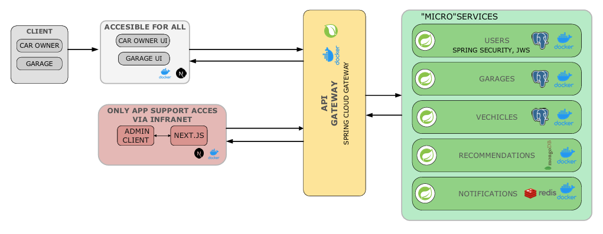
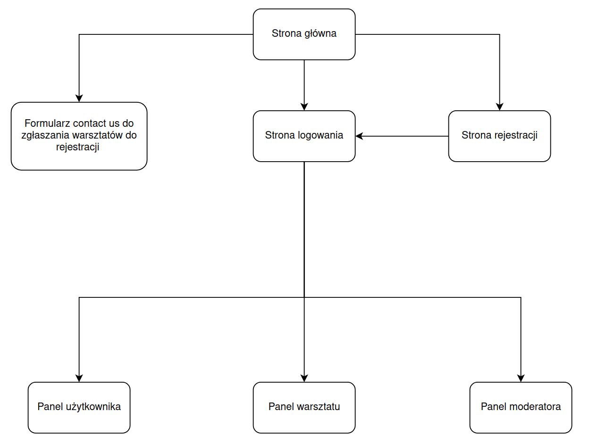
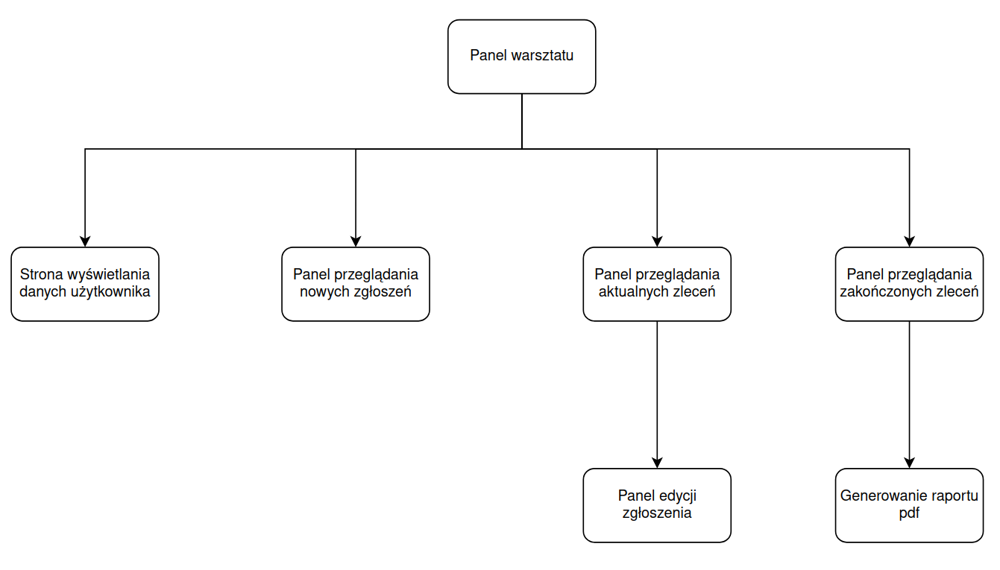
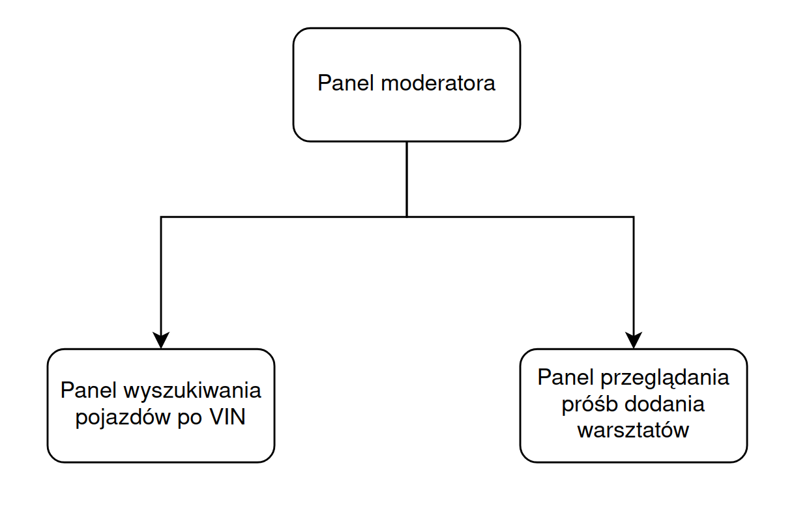

# Strona główna

## Nawiguj do:

<div style="display: flex; gap: 10px; flex-wrap: wrap;">

<a href="frontend/index.html" class="md-button md-button--primary">Frontend</a>

<a href="backend/index.html" class="md-button md-button--primary">Backend</a>

<a href="tests/index.html" class="md-button md-button--primary">Testy</a>

</div>

## Skład zespołu

<div style="display: flex; flex-wrap: wrap;">
  <div style="flex: 33.33%; padding-right: 20px;">
    <ul>
      <li>Aleksandra Bigda</li>
      <li>Grzegorz Kochański</li>
      <li>Wojciech Makurat</li>
    </ul>
  </div>
  <div style="flex: 33.33%; padding-right: 20px;">
    <ul>
      <li>Paweł Skowron</li>
      <li>Jakub Tokarski</li>
    </ul>
  </div>
  <div style="flex: 33.33%; padding-left: 20px;">
    <ul>
      <li>Kamil Wójcik</li>
      <li>Kamil Zych</li>
    </ul>
  </div>
</div>


## Dokumentacja analityczna `My Car Specialist`

### Projekt: System dla warsztatów samochodowych

#### Opis projektu

System będzie miał za zadanie umożliwić komunikację między klientem, a warsztatem samochodowym w zakresie obsługi i napraw pojazdów. Za jego pomocą klient będzie mógł sprawdzić historię napraw swojego auta wraz z poniesionymi z ich tytułu kosztami. Oprogramowanie będzie również oferowało funkcjonalność pozwalającą na sprawdzenie informacji o pojezdzie po jego numerze VIN. Dodatkowo zostanie zaimplementowana możliwość komunikacji mailowej z klientem w celu przypomnienia o nadchodzącym terminie wizyty oraz o zakończeniu serwisu.

System umożliwi pracownikom warsztatu rejestrację wykonanych prac serwisowych. Każda czynność wykonana przy pojeździe będzie posiadać opis przyjętego pojazdu (nr VIN, przebieg, zauważone uszkodzenia), wykorzystane części, kosztorys i dodatkowy opis, w którym w zależności od potrzeb, zostaną zawarte wszystkie informacje kluczowe w dalszej poprawnej eksploatacji pojazdu, lub przyszłych napraw.

### Funkcje systemu dostępne dla klienta:
-   system logowania i rejestracji użytkownika,
-   przypisanie pojazdu do swojego konta (podanie poprawnej kombinacji numeru rejestracyjnego i numeru VIN),
-   sprawdzenie pojazdu po numerze VIN,
-   przeglądanie historii serwisowej,
-   tworzenie zgłoszenia serwisowego,
-   kontakt mailowy z warsztatem,
-   generowanie raportów PDF z napraw.

### Funkcje systemu dostępne dla pracowników warsztatu:
-   panel administracyjny,
-   tworzenie historii serwisowej,
-   kontakt z klientem (wiadomości E-mail),
-   zmiana statusu naprawy,
-   generowanie zgłoszenia serwisowego dla serwisanta na podstawie odebranego zgłoszenia online, lub wypełnionego ręcznie (do wydruku),
-   generowanie raportów PDF z napraw,
-   automatyczna archiwizacja napraw.

### Przewidywana struktura aplikacji będzie się składać z:
-   Frontend SPA (Single-Page-Application) z systemem autoryzacji użytkownika, gdzie w zależności od uprawnień będzie miał dostęp do odpowiednich funkcjonalności.
-   Backend zarządzający logiką operacji wewnątrz aplikacji.
-   Baza danych klientów, pojazdów, czynności serwisowych ze szczegółami i kosztorysami, faktur.


## Schemat struktury



### Strona główna



### Panel użytkownika


### Panel warsztatu



### Panel moderatora



## Poradnik użytkownika

<iframe src="assets/Poradnik_użytkowania.pdf" width="150%" height="800px">
    Twoja
</iframe>

## Schemat projektu

<div style="display: flex; gap: 10px;">

<div style="width: 40%;">

Frontend

```bash

├── 404.tsx
├── 500.tsx
├── about
│   └── page.tsx
├── auth
│   ├── login
│   │   └── page.tsx
│   └── register
│       └── page.tsx
├── _document.tsx
├── form
│   └── page.tsx
└── [name]
├── client-dashboard
│   ├── add-request
│   │   └── page.tsx
│   ├── client-info
│   │   └── page.tsx
│   ├── page.tsx
│   ├── requests-list
│   │   ├── page.tsx
│   │   ├── request-actual
│   │   │   └── page.tsx
│   │   └── request-history
│   │       └── page.tsx
│   └── vehicles
│       ├── add-car
│       │   └── page.tsx
│       ├── page.tsx
│       └── show-vehicles
│           └── page.tsx
├── garage-dashboard
│   ├── actual
│   │   ├── [id]
│   │   │   └── page.tsx
│   │   └── page.tsx
│   ├── garage-info
│   │   └── page.tsx
│   ├── history
│   │   └── page.tsx
│   ├── page.tsx
│   └── pending-ticket-list
│       └── page.tsx
├── moderator-dashboard
│   ├── check-car
│   │   └── page.tsx
│   ├── check-requests
│   │   └── page.tsx
│   └── page.tsx
└── page.tsx
```

</div> <div style="width: 60%;">

Backend

```bash

├───.idea
│   ├───httpRequests
│   └───modules
├───docs
│   ├───assets
│   ├───backend-md
│   ├───frontend-md
│   └───main-md
└───spring_apps
    ├───api-gateway
    │   ├───.gradle
    │   │   ├───8.11.1
    │   │   │   ├───checksums
    │   │   │   ├───executionHistory
    │   │   │   ├───expanded
    │   │   │   ├───fileChanges
    │   │   │   ├───fileHashes
    │   │   │   └───vcsMetadata
    │   │   ├───buildOutputCleanup
    │   │   └───vcs-1
    │   ├───build
    │   │   ├───classes
    │   │   │   └───java
    │   │   │       └───main
    │   │   │           └───com
    │   │   │               └───apsi_projekt
    │   │   │                   └───api_gateway
    │   │   │                       └───security
    │   │   ├───generated
    │   │   │   └───sources
    │   │   │       ├───annotationProcessor
    │   │   │       │   └───java
    │   │   │       │       └───main
    │   │   │       └───headers
    │   │   │           └───java
    │   │   │               └───main
    │   │   ├───reports
    │   │   │   └───problems
    │   │   ├───resources
    │   │   │   └───main
    │   │   └───tmp
    │   │       └───compileJava
    │   │           └───compileTransaction
    │   │               ├───backup-dir
    │   │               └───stash-dir
    │   ├───gradle
    │   │   └───wrapper
    │   └───src
    │       ├───main
    │       │   ├───java
    │       │   │   └───com
    │       │   │       └───apsi_projekt
    │       │   │           └───api_gateway
    │       │   │               └───security
    │       │   └───resources
    │       └───test
    │           └───java
    │               └───com
    │                   └───apsi_projekt
    │                       └───api_gateway
    ├───garage-service
    │   ├───.gradle
    │   │   ├───8.11.1
    │   │   │   ├───checksums
    │   │   │   ├───executionHistory
    │   │   │   ├───expanded
    │   │   │   ├───fileChanges
    │   │   │   ├───fileHashes
    │   │   │   └───vcsMetadata
    │   │   ├───buildOutputCleanup
    │   │   └───vcs-1
    │   ├───build
    │   │   ├───classes
    │   │   │   └───java
    │   │   │       └───main
    │   │   │           └───com
    │   │   │               └───apsi_projekt
    │   │   │                   └───garage_service
    │   │   │                       ├───dto
    │   │   │                       ├───model
    │   │   │                       ├───repositories
    │   │   │                       ├───rest
    │   │   │                       ├───security
    │   │   │                       └───service
    │   │   ├───generated
    │   │   │   └───sources
    │   │   │       ├───annotationProcessor
    │   │   │       │   └───java
    │   │   │       │       └───main
    │   │   │       └───headers
    │   │   │           └───java
    │   │   │               └───main
    │   │   ├───reports
    │   │   │   └───problems
    │   │   ├───resources
    │   │   │   └───main
    │   │   └───tmp
    │   │       └───compileJava
    │   │           └───compileTransaction
    │   │               ├───backup-dir
    │   │               └───stash-dir
    │   ├───gradle
    │   │   └───wrapper
    │   └───src
    │       ├───main
    │       │   ├───java
    │       │   │   └───com
    │       │   │       └───apsi_projekt
    │       │   │           └───garage_service
    │       │   │               ├───dto
    │       │   │               ├───model
    │       │   │               ├───repositories
    │       │   │               ├───rest
    │       │   │               ├───security
    │       │   │               └───service
    │       │   └───resources
    │       └───test
    │           └───java
    │               └───com
    │                   └───apsi_projekt
    │                       └───garage-service
    ├───notification-service
    │   ├───.gradle
    │   │   ├───8.11.1
    │   │   │   ├───checksums
    │   │   │   ├───executionHistory
    │   │   │   ├───expanded
    │   │   │   ├───fileChanges
    │   │   │   ├───fileHashes
    │   │   │   └───vcsMetadata
    │   │   ├───buildOutputCleanup
    │   │   └───vcs-1
    │   ├───build
    │   │   ├───classes
    │   │   │   └───java
    │   │   │       └───main
    │   │   │           └───com
    │   │   │               └───apsi_projekt
    │   │   │                   └───notification_service
    │   │   │                       ├───rest
    │   │   │                       └───security
    │   │   ├───generated
    │   │   │   └───sources
    │   │   │       ├───annotationProcessor
    │   │   │       │   └───java
    │   │   │       │       └───main
    │   │   │       └───headers
    │   │   │           └───java
    │   │   │               └───main
    │   │   ├───reports
    │   │   │   └───problems
    │   │   ├───resources
    │   │   │   └───main
    │   │   └───tmp
    │   │       └───compileJava
    │   │           └───compileTransaction
    │   │               ├───backup-dir
    │   │               └───stash-dir
    │   ├───gradle
    │   │   └───wrapper
    │   └───src
    │       ├───main
    │       │   ├───java
    │       │   │   └───com
    │       │   │       └───apsi_projekt
    │       │   │           └───notification_service
    │       │   │               ├───rest
    │       │   │               └───security
    │       │   └───resources
    │       └───test
    │           └───java
    │               └───com
    │                   └───apsi_projekt
    │                       └───notification-service
    ├───recommendation-service
    │   ├───.gradle
    │   │   ├───8.11.1
    │   │   │   ├───checksums
    │   │   │   ├───executionHistory
    │   │   │   ├───expanded
    │   │   │   ├───fileChanges
    │   │   │   ├───fileHashes
    │   │   │   └───vcsMetadata
    │   │   ├───buildOutputCleanup
    │   │   └───vcs-1
    │   ├───build
    │   │   └───reports
    │   │       └───problems
    │   ├───gradle
    │   │   └───wrapper
    │   └───src
    │       ├───main
    │       │   ├───java
    │       │   │   └───com
    │       │   │       └───apsi_projekt
    │       │   │           └───recommendation_service
    │       │   │               └───rest
    │       │   └───resources
    │       └───test
    │           └───java
    │               └───com
    │                   └───apsi_projekt
    │                       └───recommendation-service
    ├───user-service
    │   ├───.gradle
    │   │   ├───8.11.1
    │   │   │   ├───checksums
    │   │   │   ├───executionHistory
    │   │   │   ├───expanded
    │   │   │   ├───fileChanges
    │   │   │   ├───fileHashes
    │   │   │   └───vcsMetadata
    │   │   ├───buildOutputCleanup
    │   │   └───vcs-1
    │   ├───build
    │   │   ├───classes
    │   │   │   └───java
    │   │   │       └───main
    │   │   │           └───com
    │   │   │               └───apsi_projekt
    │   │   │                   └───user_service
    │   │   │                       ├───controllers
    │   │   │                       ├───models
    │   │   │                       ├───payload
    │   │   │                       │   ├───request
    │   │   │                       │   └───response
    │   │   │                       ├───repositories
    │   │   │                       ├───rest
    │   │   │                       └───security
    │   │   │                           ├───jwt
    │   │   │                           └───services
    │   │   ├───generated
    │   │   │   └───sources
    │   │   │       ├───annotationProcessor
    │   │   │       │   └───java
    │   │   │       │       └───main
    │   │   │       └───headers
    │   │   │           └───java
    │   │   │               └───main
    │   │   ├───reports
    │   │   │   └───problems
    │   │   ├───resources
    │   │   │   └───main
    │   │   └───tmp
    │   │       └───compileJava
    │   │           └───compileTransaction
    │   │               ├───backup-dir
    │   │               └───stash-dir
    │   ├───gradle
    │   │   └───wrapper
    │   └───src
    │       ├───main
    │       │   ├───java
    │       │   │   └───com
    │       │   │       └───apsi_projekt
    │       │   │           └───user_service
    │       │   │               ├───controllers
    │       │   │               ├───models
    │       │   │               ├───payload
    │       │   │               │   ├───request
    │       │   │               │   └───response
    │       │   │               ├───repositories
    │       │   │               ├───rest
    │       │   │               └───security
    │       │   │                   ├───jwt
    │       │   │                   └───services
    │       │   └───resources
    │       └───test
    │           └───java
    │               └───com
    │                   └───apsi_projekt
    │                       └───user_service
    └───vehicle-service
        ├───.gradle
        │   ├───8.11.1
        │   │   ├───checksums
        │   │   ├───executionHistory
        │   │   ├───expanded
        │   │   ├───fileChanges
        │   │   ├───fileHashes
        │   │   └───vcsMetadata
        │   ├───buildOutputCleanup
        │   └───vcs-1
        ├───build
        │   └───reports
        │       └───problems
        ├───gradle
        │   └───wrapper
        └───src
            ├───main
            │   ├───java
            │   │   └───com
            │   │       └───apsi_projekt
            │   │           └───vehicle_service
            │   │               ├───config
            │   │               ├───model
            │   │               ├───repository
            │   │               ├───rest
            │   │               ├───security
            │   │               └───service
            │   └───resources
            └───test
                └───java
                    └───com
                        └───apsi_projekt
                            └───vehicle_service
```